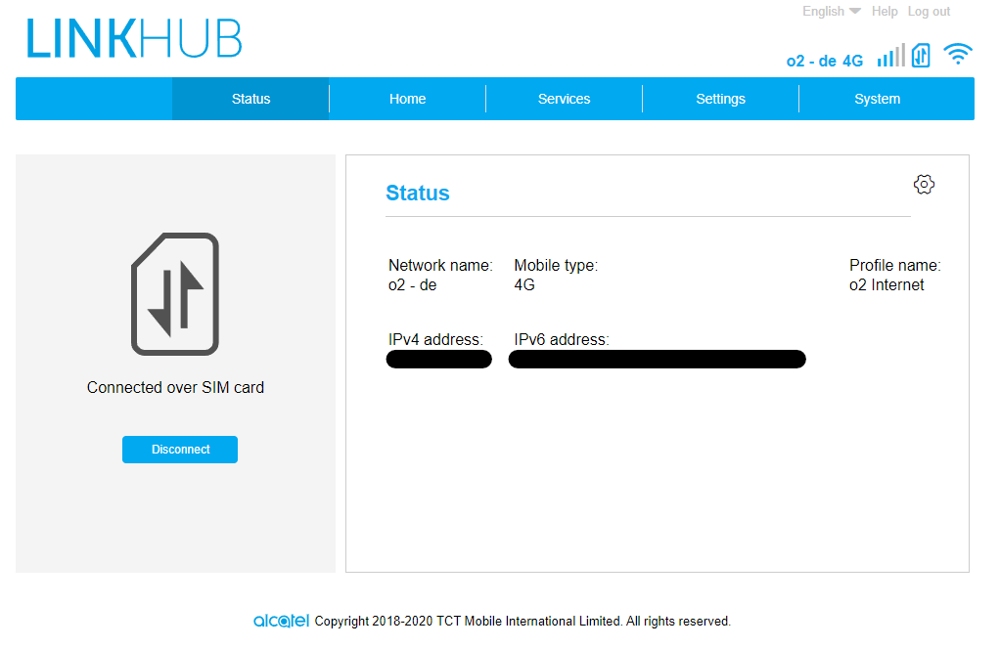

# LTEMonitor

Software to monitor the status of a LinkHub LTE modem via Prometheus and Grafana.

## Usage

```yaml
services:
  lte_exporter:
    image: ghcr.io/ltmonitor/ltmonitor:latest
    restart: unless-stopped
    ports:
      - "8080:8080"
    environment:
      - "Config__Url=http://<your_modem_ip>/" # in most cases this is 192.168.1.1
      # EncryptionKey and RequestVerificationKey must be extracted from the JavaScript code at:
      # http://<your_modem_ip>/dist/build.js
      - "Config__EncryptionKey=" # search for ".encrypt=", there should be a long string somewhere
      - "Config__RequestVerificationKey=" # search for "_TclRequestVerificationKey="
      # - "Config__Username=admin" # optional, default is 'admin'
      - "Config__Password=<your_password>"
```

## Metrics

```prototext
bytes{direction="download"} 1061476
bytes{direction="upload"} 1572919
connection_status 2
connection_time{ipv4="123.234.213.132",ipv6="2a02::5a5f"} 6060
lan{ipv4="192.168.1.100",mac="xx:xx:xx:xx:xx:xx"} 1
rate{direction="download"} 100000000
rate{direction="upload"} 50000000
speed{direction="download"} 85
speed{direction="upload"} 96
uptime 1473851
used_data 1653571841
```

## Screenshot


